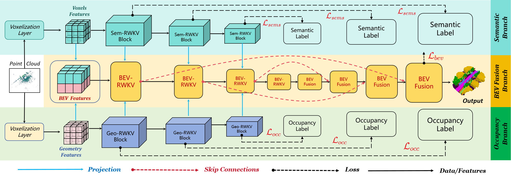

<div align="center">
    <h1>🤖 OccRWKV</h1>
    <h2>Rethinking Efficient 3D Semantic Occupancy Prediction with Linear Complexity</h2> <br>
     <a href='https://arxiv.org/abs/2409.19987'></a>
     <a href='https://jmwang0117.github.io/OccRWKV/'></a>
</div>

## 🤗 AGR-Family Works

* [OccRWKV](https://jmwang0117.github.io/OccRWKV/) (ICRA 2025.01): The First RWKV-based 3D Semantic Occupancy Network
* [OMEGA](https://jmwang0117.github.io/OMEGA/) (RA-L 2024.12): The First AGR-Tailored Dynamic Navigation System.
* [HE-Nav](https://jmwang0117.github.io/HE-Nav/) (RA-L 2024.09): The First AGR-Tailored ESDF-Free Navigation System.
* [AGRNav](https://github.com/jmwang0117/AGRNav) (ICRA 2024.01): The First AGR-Tailored Occlusion-Aware Navigation System.

## 🎉 Chinese Media Reports/Interpretations
* [2024.10] - [RWKV Official Website](https://rwkv.cn/)
* [2024.10] - [Autonomous Driving Daily](https://mp.weixin.qq.com/s/s8Ujgfsd5iLDE8VT-vQ43A)
* [2024.10] - [ADFeed](https://mp.weixin.qq.com/s/ImSyMZUIF67Uq706CY9f_w)
* [2024.10] - [Intelligent Driving Lab](https://mp.weixin.qq.com/s/sGiV_PKB_nZWXRApce7IsA)

## 📢 News

- [2024/09.28]: OccRWKV's logs are available for download:
<div align="center">

| OccRWKV Results | Experiment Log |
|:------------------------------------------------------------------:|:----------:|
|OccRWKV on the SemanticKITTI hidden official test dataset | [link](https://connecthkuhk-my.sharepoint.com/:t:/g/personal/u3009632_connect_hku_hk/EYqFDMD6xexCqXwfZ_nPxEUB0akfqePg4TwuGiuf4fQK0Q?e=PFM1ma) |
|OccRWKV train log | [link](https://connecthkuhk-my.sharepoint.com/:u:/g/personal/u3009632_connect_hku_hk/EcKG5MgDCTJJuu8DJ7VoS9sB0euzAEaMkpLjlY9LvRJ0GA?e=lwddX3) |

</div>

- [2024/09.15]: The pre-trained model can be downloaded at  [OneDrive](https://connecthkuhk-my.sharepoint.com/:u:/g/personal/u3009632_connect_hku_hk/ETCUIJ7rPnFJniQYMsDsPyIBHkzirRP4c3n-eU9fcBZTaA?e=P8AkQ2).
- [2024/09.01]: 🔥 We released the code of OccRWKV. *The First Receptance Weighted Key Value (RWKV)-based 3D Semantic Occupancy Network*

</br>

## 📜 Introduction

**OccRWKV** introduces an efficient semantic occupancy prediction network that smartly decouples semantics and occupancy with specialized RWKV blocks, achieving superior accuracy and real-time performance for 3D semantic scene understanding. Its use of BEV space and sparse feature projection significantly reduces computational demands, making it highly suitable for enhancing real-time autonomous navigation in robotic systems.


<p align="center">
  
</p>

<br>


## 🚀 Citing

```
@article{wang2024occrwkv,
  title={OccRWKV: Rethinking Efficient 3D Semantic Occupancy Prediction with Linear Complexity},
  author={Wang, Junming and Yin, Wei and Long, Xiaoxiao and Zhang, Xingyu and Xing, Zebin and Guo, Xiaoyang and Zhang, Qian},
  journal={arXiv preprint arXiv:2409.19987},
  year={2024}
}
```

Please kindly star ⭐️ this project if it helps you. We take great efforts to develop and maintain it 😁.


## 🛠️ Installation

```
conda create -n occ_rwkv python=3.10 -y
conda install pytorch==2.1.0 torchvision==0.16.0 torchaudio==2.1.0 pytorch-cuda=12.1 -c pytorch -c nvidia -y
pip install spconv-cu120
pip install tensorboardX
pip install dropblock
pip install pyg_lib torch_scatter torch_sparse torch_cluster torch_spline_conv -f https://data.pyg.org/whl/torch-2.1.0+cu121.html
pip install -U openmim
mim install mmcv-full
pip install mmcls==0.25.0
```

## 💽 Dataset

Please download the Semantic Scene Completion dataset (v1.1) from the [SemanticKITTI website](http://www.semantic-kitti.org/dataset.html) and extract it.

Or you can use [voxelizer](https://github.com/jbehley/voxelizer) to generate ground truths of semantic scene completion.

The dataset folder should be organized as follows.
```angular2
SemanticKITTI
├── dataset
│   ├── sequences
│   │  ├── 00
│   │  │  ├── labels
│   │  │  ├── velodyne
│   │  │  ├── voxels
│   │  │  ├── [OTHER FILES OR FOLDERS]
│   │  ├── 01
│   │  ├── ... ...
```

## 🤗 Getting Start
Clone the repository:
```
https://github.com/jmwang0117/OccRWKV.git
```


### Train OccRWKV Net

```
$ cd <root dir of this repo>
$ bash scripts/run_train.sh
```
### Validation


```
$ cd <root dir of this repo>
$ bash scripts/run_val.sh
```
### Test

Since SemantiKITTI contains a hidden test set, we provide test routine to save predicted output in same format of SemantiKITTI, which can be compressed and uploaded to the [SemanticKITTI Semantic Scene Completion Benchmark](http://www.semantic-kitti.org/tasks.html#ssc). You can provide which checkpoints you want to use for testing. We used the ones that performed best on the validation set during training. For testing, you can use the following command.

```
$ cd <root dir of this repo>
$ bash scripts/run_test.sh
```


## 🏆 Acknowledgement
Many thanks to these excellent open source projects:
- [RWKV](https://github.com/BlinkDL/RWKV-LM)
- [Vision-RWKV](https://github.com/OpenGVLab/Vision-RWKV)
- [SSC-RS](https://github.com/Jieqianyu/SSC-RS)
- [Co-Occ](https://github.com/Rorisis/Co-Occ)
- [AGRNav](https://github.com/jmwang0117/AGRNav)
- [HE-Nav](https://github.com/jmwang0117/HE-Nav)


